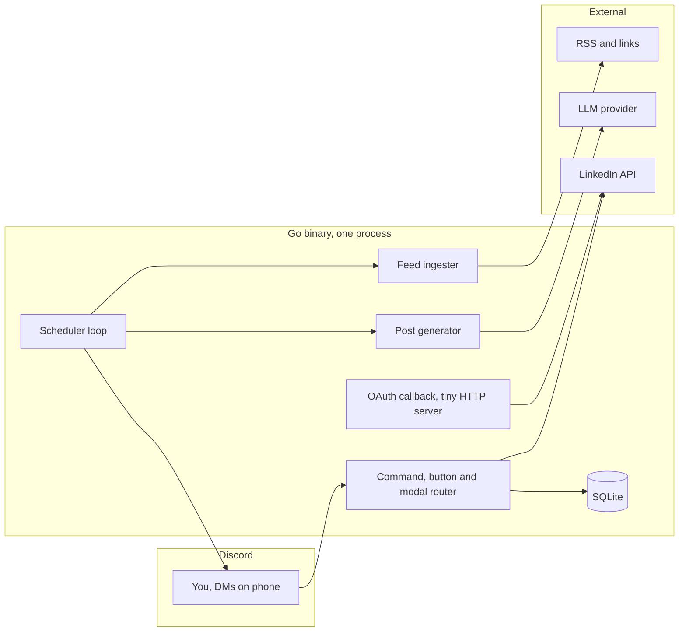

# Pulse

A Discord bot that keeps your LinkedIn presence alive without the daily grind.
It watches your sources, drafts posts with an LLM, reminds you on a schedule
over Discord DM, and publishes to LinkedIn when you approve.

## How it works



## Quickstart

```sh
cp .env.example .env   # fill in Discord token, LinkedIn app, optional LLM key
go run ./cmd/bot
```

Then in Discord: DM the bot `/link` to connect LinkedIn, `/source-add <url>`
to add a source, `/schedule-set 09:00 monday wednesday friday` to set reminders.

Full setup (LinkedIn developer app, Discord application, deploy) is below.

## Setup

TODO: LinkedIn app, Discord bot, deploy instructions.

## Commands

TODO: command reference.

## License

MIT. See [LICENSE](LICENSE).
