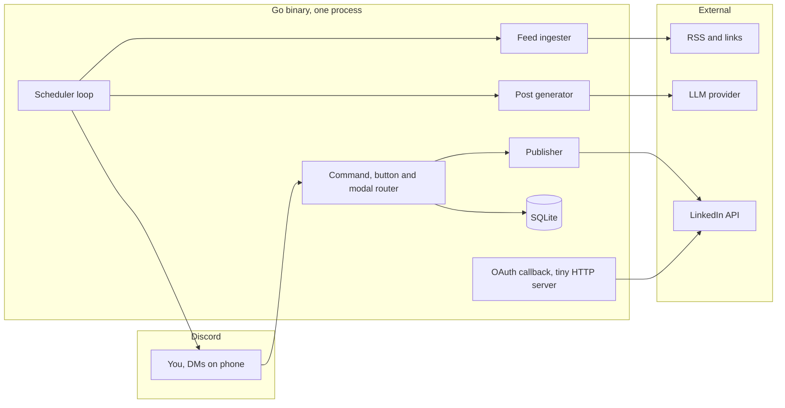

# Pulse

A Discord bot that keeps your LinkedIn presence alive without the daily grind.
It watches your sources, drafts posts with an LLM, reminds you on a schedule
over Discord DM, and publishes to LinkedIn when you approve.

## How it works



On schedule the bot DMs you a draft card with buttons: **Approve** posts it
to LinkedIn and returns the live link, **Edit** opens a text editor,
**Regenerate** draws another source item, **Skip** drops it, **Snooze 1h**
brings it back in an hour.

## Quickstart

```sh
cp .env.example .env   # fill in Discord token, LinkedIn app, optional LLM key
go run ./cmd/bot
```

Then DM the bot: `/link` to connect LinkedIn, `/source-add <url>` to add a
source, `/schedule-set 09:00 monday wednesday friday` to set reminders.

## Setup

### 1. Discord application, about 5 minutes

1. Open the [Discord Developer Portal](https://discord.com/developers/applications),
   create an application, go to the Bot tab, reset and copy the token into
   `DISCORD_TOKEN`.
2. On the OAuth2 URL Generator page select scopes `bot` and
   `applications.commands`, no privileged permissions needed, open the URL and
   add the bot to your server. Slash commands also work in DMs with the bot.
3. While developing, set `DEV_GUILD_ID` to your server id so commands appear
   instantly. Global registration can take up to an hour.

### 2. LinkedIn developer app, about 10 minutes

1. Open the [LinkedIn Developer Portal](https://www.linkedin.com/developers/),
   create an app, and on the Products tab add **Sign In with LinkedIn** and
   **Share on LinkedIn**. Both are self-serve for posting to your own
   profile, no review queue.
2. On the Auth tab add your callback URL to Authorized redirect URLs, e.g.
   `http://localhost:8081/oauth/linkedin/callback` for local runs or
   `https://your-host/oauth/linkedin/callback` in production. Copy the
   Client ID and Client Secret into the env file.
3. DM the bot `/link`, open the connect link, sign in to LinkedIn and
   approve. The bot confirms when it is linked.

One honest limitation: LinkedIn consumer tokens expire after about 60 days
and consumer apps get no refresh token. Pulse warns you three days ahead,
daily once expired, and reconnecting is one `/link` tap. Everything else
survives untouched.

### 3. Environment

See [.env.example](.env.example) for every variable. The only required ones
are `DISCORD_TOKEN`, `LINKEDIN_CLIENT_ID`, `LINKEDIN_CLIENT_SECRET` and
`LINKEDIN_REDIRECT_URI`. Leave `LLM_API_KEY` empty to use the built-in
offline generator; set it plus `LLM_BASE_URL` and `LLM_MODEL` to use any
OpenAI-compatible provider.

## Commands

| Command | What it does |
|---|---|
| `/link` | Connect or reconnect LinkedIn |
| `/status` | LinkedIn, schedule, sources, drafts at a glance |
| `/source-add <url>` | Add an RSS feed or page |
| `/source-list` | Show sources with ids |
| `/source-remove <id>` | Drop a source |
| `/schedule-set <time> <days>` | Set reminders, e.g. `09:00 monday wednesday friday`, also `daily`, `weekdays`, `weekends` |
| `/schedule-status` | Show the schedule |
| `/schedule-off` | Stop reminders |
| `/draft` | Generate one right now |
| `/history [limit]` | Recent drafts and posts |
| `/autopost <true\|false>` | Post without approval at schedule time |
| `/help` | Command list |

## Deploy

Docker, one static binary with SQLite on a volume:

```sh
docker build -t pulse .
docker run -d --name pulse --env-file .env -v pulse-data:/data -p 8081:8081 pulse
```

A Fly.io example lives in [deploy/fly.toml](deploy/fly.toml): create a
volume for `/data`, set secrets with `fly secrets set`, deploy. The callback
URL registered in your LinkedIn app must match the public host.

## Development

```sh
go build ./...
go vet ./...
go test ./...
```

Layout: `cmd/bot` wires everything; `internal/config` env loading;
`internal/store` SQLite; `internal/linkedin` OAuth and Posts API;
`internal/feeds` RSS and page ingestion; `internal/generate` LLM client and
fallback; `internal/publisher` posting with refresh; `internal/discord`
commands, cards and modals; `internal/scheduler` the reminder loop.

Branch off `main` for changes, conventional commits, squash merge. Docs stay
in sync with behavior in the same PR.

## License

MIT. See [LICENSE](LICENSE).
